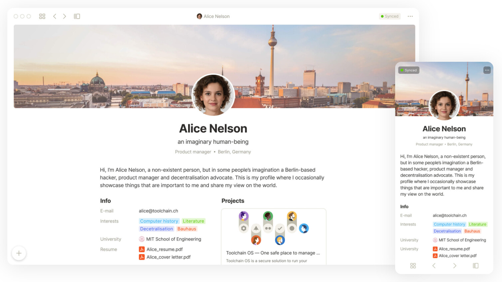
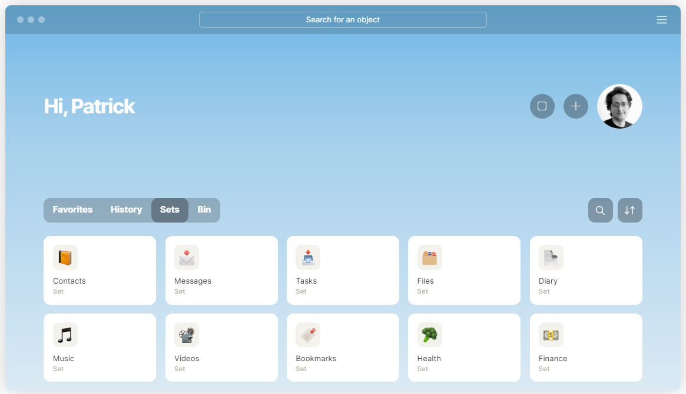

   
  
   
   

Meet Anytype: Private, local, p2p computing. Available on Mac, Windows, Linux, Android & iOS

## Awesome AnyType Resources 

> 🎉 A curated collection of useful links, tutorials, and resources for the AnyType app – a knowledge management and organization tool. Explore guides, templates, and community-contributed content to enhance your experience with AnyType.

## 🧾 Contents

1. [Official Documentation](#📝official-documentation)
2. [Tutorials](#▶-youtube-tutorials)
3. [Community Templates](#🖼-community-templates)
4. [External Resources](#🔗external-resources)
5. [Contribution Guidelines](#contribution-guidelines)
6. [Our Repo Tutorials and Resources](#💿-our-repo-tutorials-and-resources)

---

# 🧠My thoughts about AnyType and How I Learned It Quickly  

- how anytype store pages?
- sets vs collections?
- how to create a database  ?
- how to create Folder?
- how it connects pages?
- why it use programming naming rather than everyday words [collections, sets, object, graph, relations, type, space, ...]?

## 🎛 AnyType Categories

- **Groups** :
  - Set : filtered by one Object type (notes...)
  - Colections: organize a variety of different objects types and `store` them in one place.

- **Objects**: page, books, Notes...

## 🗄 Object In AnyType

- At Anytype we have created the concept that everything you create is an Object. Pages, Notes, Recipes, Books, Movies, Audio, Humans, everything!
- These are all Objects that are organized and categorized by Types.
- You can connect different Types by Relations and see how this is visualized on the Graph.

## ✏ Blocks

- Your object is made up of different types of blocks to organize your information, and the place where all of these Blocks live together is called the Canvas. Anytype's block-based editor works very similarly to that of blogging sites or website builders.

## Types

- Types are the classification system we use to categorize Objects
- Every object has a Type, which is defined at the time of Object creation (and can be changed later)
- Different Types are used to define Objects which are categorically different from each other
- examples of Types you might have in your graph:Task,Note, Book, Movie, Idea

## Relations

-Relations are key to organizing and connecting your Objects and knowledge in Anytype. There are two functions that Relations serve in Anytype

- Defining attributes: You can use Relations to define the characteristics of a certain Object.
  - For example, when creating a Task in Anytype, you can add Relations such as Status: Done/Not Done, or Priority: Low, Medium, or High.
  - If we were to imagine a database, Relations represent the column headers to each row (where column A is the Object).
  - Once you have set your attributes, it becomes possible to sort and filter your Objects according to the Relations you've defined in Set View.
- Defining connections: You can also use Relations to link one Object to another.
  - Returning to the example of a Task, you can add the Relation: Assignee, and assign another Object in your Anytype to this task.
  - As above, you can view the Assignees as Relations in Set view, or in Graph view.

## 🗄 Set In AnyType

- A live search of all Objects which share a common Type or Relation
- Sets don't store Objects like regular databases.
- Sets serve two primary functions: Organizing and Accessing Objects and Editing Objects quickly.
- to find all pages where type is Notes, Create a `Set` based on Type which will display every Note you've created in Anytype.
- If you have specific `notes` you'd like to frequently access, you can filter them based on Relations you've added to these notes using Set.
- set : For instance: Creation Date, Tags, or Priority. (In this sense, Relations behave like attributes).
- You can then pin your `Set` to your Favorites menu, where it will sit on your Sidebar, acting like a folder for all Objects that meet certain criteria.
- Sets also provide a way to quickly edit Objects in a list View.
- You can use multi-select Objects in Sets to delete multiple Objects at once, or to batch update the Object Type. Any Relations added to a Set in the Relation Menu (top right), will be adopted by all new Objects created with the "+ New Object" button.
- **Toggle & Add Relations to Objects via Sets** :
  - Instead of adding Relations one-by-one to Objects, you can batch-add them to your Set by clicking the filters on the right side.
  - Here you can toggle on/off any Relations that you would like to see, add another Relation or new relation, and edit the View of the Set here.
  - You can add any Relations to be automatically added to your Objects, by adding them in the creation process of your Type.

## 📁 Collections

- A folder-like structure where where you can visualize and batch edit objects of any type
- These are similar to Sets in their appearance and layout, however functioning differently.
- Contrary to Sets, Collections are not filtered by Object Type but are in fact `open` to any Object Type.
- Collections can be used to organize a variety of different objects and store them in one place.
- You are not restricted to viewing only one Object Type at a time, this means you can have multiple different types within one collection.
- In a Collection, you can organize all of this Types together seamlessly.

---

## ⚡    Quick equivalents  name

|Anytype name | real means |
|:-:|:-|
|`Space` | _Acount:_ [contain graph of objects] |
|`Object` | _Pages:_ [Pages, Notes, Recipes, Books, Movies, Audio, Humans, everything! ]|
|`Blocks`|[text, headings...]|
|`Types` |page type: [Task, Note,Book, Movie,Idea] |
|`Layouts`| Profile Type|
|`Templates`|each Type can support multiple Templates [reuse the same structures] |
|`Relations`| **Defining attribute** :sort and filter [Status: Done/Not Done,] ; **Defining connections:** link one Object to another[add the Relation: Assignee, and assign another Object in your Anytype to this task.], you can view the Assignees as Relations in Set view, or in Graph view.|
|`Backlinks`|Backlinks and forward links have been implemented as relations|
|`Library`| a place where you can found types, and relations|
|`Type Library`| used and anytype pages types|
|`Relation Library`|used and anytype pages Relations|
|`Links`|Link to another Object Directly  [/ or @] , or external [file:///Users..pdf]|
|`Graph`|visual design where you can see which Objects are connected together, and the direction everything flows, search for pages, and search and optimize some settings|
|`Sets`| A live search of all Objects which share a common Type or Relation,   Sets don't store Objects like regular databases, Organizing and Accessing Objects, |
|`Collections`|folders [rganize a variety of different objects and store them in one place]|

---

##  Official Documentation

- [Get the App](https://download.anytype.io/)
- [AnyType Documentation](https://docs.anytype.io/): Explore the official documentation for in-depth information on using AnyType, its features, and best practices.
- [Blog](https://blog.anytype.io/)
- [FAQ](https://anytype.io/faq)
- [join to contribute](https://anytype.io/contributors)
- [ANY Experience Gallery](https://gallery.any.coop/) : Explore experiences made by power users, Simply install to your space and boost up your workflow.

## 📪 Contacts

 [X](https://twitter.com/AnytypeLabs) |  [github](https://github.com/anyproto) |  [telegram](https://t.me/anytype)

---

## 💿 Our Repo Tutorials and Resources

- [Quick Start with Any type](Tutorial/Quck%20Start.md)
- [Comparison AnyType vs Notion Terms and Features](Tutorial/anytype-vs-notion-terms.md)
- [markdown sheat sheet](Tutorial/markdown-sheat-sheet.md)

## ▶ Youtube Tutorials

- [AnyType Ofical Youtube channel](https://www.youtube.com/@Anytype/videos): 
- [A step-by-step guide for beginners to kickstart their journey with AnyType.](https://www.youtube.com/@pianomacpower)
- [Our Review: Testing the PARA Method in Anytype](https://youtu.be/rgBS46Scw4Q?si=x2O78MTWyLh78epj)
- [Anytype tutorial - Offline Notes Initial Setup +Tips (Jan 2024)](https://youtu.be/Ts4PyVZ1R7o?si=Q0UhWjhmRX-Wmdxi)
- [Anytype: The Best Offline Alternative to Notion](https://youtu.be/pIWsKwEqG00?si=VmJh_ZXVbSa0L2LN)
- [Can this app dethrone Notion? | Anytype First Look](https://youtu.be/xOGjnjL1SLU?si=Kh6QCcFAzSFYvADf)
- [My beginners look at Anytype (not sponsored)](https://youtu.be/OZsLRcdjOlA?si=hVQoiLqntCk7yGN4)
- [3 Anytype HACKS You Didn’t Know!](https://youtu.be/Ru5iT8d1aeI?si=PYw6jVffgxasLnkm)
- [Learning anytype fundamentals](https://youtu.be/-dgOxSBpmfI?si=jtGbw02sEXSFajeR)
- [Anytype template - Daily Journal Experience (Jan 2024)](https://youtu.be/77KuRt9Z8dY?si=1C4aoH7zPQQPc5xl)
- [Anytype tutorial - Easy Folder Organization (Jan 2024)](https://youtu.be/Ja3Tk4eu048?si=-pRKEsaZabsoIb9j)
- [Anytype tutorial - How I Use Search, Tags, & Sets](https://youtu.be/Ja3Tk4eu048?si=nY_WeZssg-8JLAIg)
- [Sets vs collections inside Anytype](https://youtu.be/9-5JHmxny_Q?si=sECFM6oyJe7ebi4D)
- [How to make templates in anytype](https://youtu.be/DDXl7rkGxvs?si=CfoSBagZknTs7D5p)
- [Create databases in anytype](https://youtu.be/UpKEi7ZrH6c?si=EqdR1BAiFvSPZHOr)
- [My anytype system](https://youtu.be/o1oZw4Nu18E?si=nhsj_jeD_j4SCzXI)
- [Learn how relations work in Anytype](https://youtu.be/8FdApck0bm0?si=ilwNHx_ulxTmRV9D)
- [Anytype Analysis: The Pros & Cons + My Experience](https://youtu.be/oA6PAx0pGyw?si=Vl34TMKmOaRzQmv1)
- [My Simple Productivity System (for normal people)!](https://youtu.be/7M6bIeVbCqA?si=sePoa7oV-gmrhDlK)
<!-- -  -->

---

## 📄 Articles  

- [Why Anytype is the Future of Note-Taking](https://medium.com/predict/why-anytype-is-the-future-of-note-taking-b75a98688192)
- [Anytype App Review: A Notion Killing Notes App?](https://toolfinder.co/tools/anytype)
- [Anytype: An All-in-One Secure Open-Source App for Work and Productivity](https://news.itsfoss.com/anytype-open-beta/)
- [Anytype: Apple Notes on Steroids! | Review](https://shuomi.medium.com/anytype-apple-notes-on-steroids-review-4a7d3b654dbb): 

---

## 🖼 Community Templates

 **coming Soon**

Browse and use templates created by the AnyType community to jumpstart your projects and workflows.

1. [Project Management Template](./templates/project-management.md): A template for organizing and managing projects within AnyType.

2. [Book Notes Template](./templates/book-notes.md): Take structured notes on books you read using this template.

---

## 🔗External Resources

Explore resources outside of official channels for additional insights and perspectives.

1. [AnyType Reddit Community](https://www.reddit.com/r/AnyType/): Join the Reddit community to connect with other AnyType users, ask questions, and share your experiences.

2. [AnyType Blog](https://blog.anytype.io/): Read the official blog for updates, tips, and feature highlights.

---

## Contribution Guidelines

Feel free to contribute by adding new links, tutorials, or resources. Follow these guidelines:

1. Fork the repository.
2. Create a new branch.
3. Add your content.
4. Create a pull request.

Let's build a comprehensive resource hub for the AnyType community together!

---

## Contributors

👏 A big thank you to the following individuals who have contributed to this Awesome Repo:

---

## License

This project is licensed under the [MIT License](LICENSE).

**🤩Happy organizing with AnyType!**

